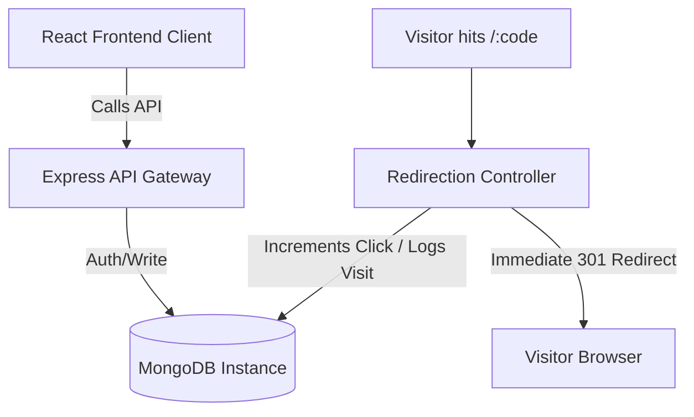

# VΛLTEX — Smart URL Analytics Platform

VΛLTEX is a premium, developer-first URL shortener and click-analytics command center designed for modern brands. It provides instant 301 redirection routing, custom branded alias matching, automated expiration checks, downloadable vector QR codes, and a fully featured dark-glassmorphic SaaS telemetry dashboard displaying breakdown metrics by browser, device, geographical region, and time.

---

## 📌 Features

- **⚡ High-Speed Redirection Engine**: Instantaneous 301 server redirection routing visitor transactions in milliseconds globally.
- **🛡️ Premium Glassmorphic Dashboard**: A clean React single-page UI featuring smooth gradients, interactive chart trends, and responsive layouts.
- **🏷️ Branded Custom Aliases**: Replace automated short codes with memorable, campaigns-aligned vanity words.
- **📅 Link Expiration Gates**: Protect limited-time campaigns by setting absolute date thresholds where links auto-expire.
- **📊 Granular Telemetry Tracking**: Logs browser types, devices (Mobile vs. Desktop), geographical countries, referrers, and hourly/daily visitor counts.
- **🖼️ Auto-Generated QR Codes**: Instantly create and download vector-aligned QR codes directly from the browser for marketing print materials.
- **🌗 Unified Theme Controls**: Seamless toggle switches between light and dark visual aesthetics.
- **🔬 Public Test-Drive Sandbox**: Allows guest users to generate real shortened links directly from the landing page using the live backend endpoint.

---

## 🛠️ Tech Stack

### Frontend Client
- **Core Framework**: React 18 + Vite (ES6 Modules)
- **Routing**: React Router DOM v6
- **Styling**: Pure CSS3 Variables (custom spatial layout sizing grid, dark glassmorphism system)
- **Icons**: Lucide React
- **Toast Notifications**: React Hot Toast
- **Chart Renderers**: Chart.js + React ChartJS 2

### Backend Server
- **Runtime Environment**: Node.js >= 18
- **Web Framework**: Express.js
- **Database Engine**: MongoDB + Mongoose ORM
- **Authentication**: JWT (JSON Web Tokens) + BcryptJS Password Salting
- **Client Security**: Helmet (CSP policies header matching), CORS (Cross-Origin Resource Sharing), and Express Rate Limit.
- **User Agent & Geo Parsers**: UA-Parser-JS, GeoIP-Lite

---

## 📁 Folder Structure

```text
valtex/
├── client/                     # Frontend client React application
│   ├── src/
│   │   ├── animations/         # Magnetic buttons, typewriter, particles background, tilt effect scripts
│   │   ├── api/                # Axios interceptors configuration
│   │   ├── components/         # Reusable widgets (Navbar, Sidebar, MetricCard, UrlTable, etc.)
│   │   ├── context/            # AuthContext and ThemeContext state providers
│   │   ├── hooks/              # Custom React hooks (useToast, etc.)
│   │   ├── pages/              # Primary route views (Landing, Dashboard, Login, Signup, Analytics)
│   │   ├── styles/             # Global CSS definitions, reset scopes, theme variables
│   │   ├── utils/              # Client utility code (QR generators, clipboard copiers)
│   │   ├── App.jsx             # React router configuration
│   │   └── main.jsx            # DOM renderer entry point
│   ├── package.json
│   └── vite.config.js
├── server/                     # Backend API server application
│   ├── config/                 # DB connection and system variables
│   ├── controllers/            # Request handlers (auth, url analytics, and redirection controls)
│   ├── middleware/             # Route guards (auth and optional auth parsers)
│   ├── models/                 # Database schema models (User, Url, Visit)
│   ├── routes/                 # Express route registration mappings
│   ├── utils/                  # Helper generators (short-codes, link validators)
│   ├── server.js               # Application server bootstrap file
│   └── package.json
├── .gitignore                  # Git ignore list
└── README.md                   # Project documentation
```

---

## 🧬 Architecture Overview

VΛLTEX uses a decoupled Client-Server architecture designed to optimize click redirection latency:



1. **API Operations**: The React client communicates with the Express backend via authenticated JSON payloads.
2. **Redirection Route**: Redirection requests bypass heavy authentication middleware to minimize roundtrip times, directly query MongoDB, insert visit logs asynchronously, and instantly issue a `301 Moved Permanently` response header to the client.

---

## 💾 Database Design

The database contains three main collections schema definitions inside MongoDB:

### 1. `users` Collection
Stores registered tenant operators.
```typescript
{
  _id: ObjectId,
  name: { type: String, required: true },
  email: { type: String, required: true, unique: true },
  password: { type: String, required: true }, // Bcrypt hashed
  createdAt: Date,
  updatedAt: Date
}
```

### 2. `urls` Collection
Stores mapped destinations and custom codes.
```typescript
{
  _id: ObjectId,
  userId: { type: ObjectId, ref: 'User', required: false }, // null for anonymous landing page creations
  originalUrl: { type: String, required: true },
  shortCode: { type: String, required: true, unique: true },
  customAlias: { type: String, default: null },
  clickCount: { type: Number, default: 0 },
  isActive: { type: Boolean, default: true },
  expiryDate: { type: Date, default: null },
  createdAt: Date,
  updatedAt: Date
}
```

### 3. `visits` Collection
Stores raw visitor traffic events for deep dashboard telemetry rendering.
```typescript
{
  _id: ObjectId,
  urlId: { type: ObjectId, ref: 'Url', required: true },
  browser: { type: String, default: 'Unknown' },
  device: { type: String, default: 'Desktop' },
  os: { type: String, default: 'Unknown' },
  country: { type: String, default: 'Unknown' },
  ip: { type: String },
  referrer: { type: String, default: 'Direct' },
  createdAt: Date
}
```

---

## ⚙️ Environment Variables

### Server: `server/.env`
Create a `.env` file in the `server` directory:
```env
PORT=5000
MONGO_URI=mongodb://localhost:27017/valtex
JWT_SECRET=valtex_ultra_secure_jwt_2026_secret
BASE_URL=http://localhost:5000
CLIENT_URL=http://localhost:5173
NODE_ENV=development
```

### Client: `client/.env`
Create a `.env` file in the `client` directory:
```env
VITE_API_URL=http://localhost:5000/api
VITE_BASE_URL=http://localhost:5000
```

---

## 🚀 Installation & Local Development

### Prerequisites
- Node.js >= 18.x
- MongoDB local instance running or Atlas URI connection

### Step-by-Step Setup

1. **Install Server Dependencies**:
   ```bash
   cd server
   npm install
   ```

2. **Install Client Dependencies**:
   ```bash
   cd ../client
   npm install
   ```

3. **Start the Database Server**:
   Ensure MongoDB is running locally:
   ```bash
   mongod
   ```

4. **Launch the Servers**:
   Run both processes in separate terminal instances or as tasks:
   
   - **Terminal 1 (Backend Server)**:
     ```bash
     cd server
     npm run dev
     ```
   - **Terminal 2 (Frontend Client)**:
     ```bash
     cd client
     npm run dev
     ```

5. **Access VΛLTEX**:
   Open [http://localhost:5173](http://localhost:5173) in your browser.

---

## 📖 API Documentation

### Auth routes (`/api/auth`)
- `POST /signup` — Register a new tenant account.
- `POST /login` — Authenticate credentials and return JWT token.
- `GET /me` — Fetch currently logged-in session user profile (*JWT protected*).
- `PUT /profile` — Update password and user details (*JWT protected*).

### URL routes (`/api/urls`)
- `POST /` — Generate shortened URL code. Supports passing `originalUrl`, optional `customAlias`, and optional `expiryDate`. (*JWT optional: public guest users allowed*).
- `GET /` — List paginated links generated by the current user (*JWT protected*).
- `PUT /:id` — Modify destination or expiration date parameters (*JWT protected*).
- `DELETE /:id` — Purge short link metadata and clear associated visits analytics (*JWT protected*).

### Analytics routes (`/api/analytics`)
- `GET /overview` — Aggregates count card metrics (total links, visits, active links) (*JWT protected*).
- `GET /:urlId` — Generates 14-day chronological line trends, devices, OS, browsers, and country telemetry lists for a specific link (*JWT protected*).

---

## 📸 Screenshots Placeholders

- **Landing Page Interface**: `client/public/screenshots/landing.png` (displays particle overlays and test-drive sandbox).
- **Redirection Dashboard**: `client/public/screenshots/dashboard.png` (displays created links table and configuration controls).
- **Telemetry Reports Panel**: `client/public/screenshots/analytics.png` (displays browser, location, device distribution charts).

---

## 🔮 Future Enhancements

- **🗺️ Interactive Map Charts**: Display regional geographic hits on a vector world map.
- **🐳 Docker Containers Deployment**: Orchestrate microservices configs for unified production scaling.
- **🏷️ Branded Subdomains**: Support custom mapping of external domains (e.g. `brand.co/code`).
- **📧 Email Telemetry Digests**: Periodic cron-job newsletters summarizing week-over-week performance logs.

---

## 📄 License

Distributed under the MIT License. See `LICENSE` for more information.

---

## 👥 Author

**VALTEX UI/UX Team**

---

This project is a part of a hackathon run by https://katomaran.com
